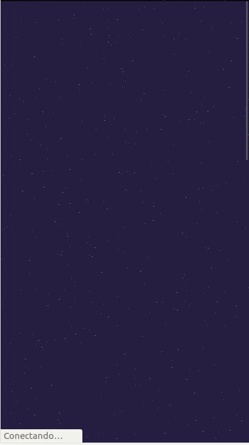

Project - Stars Wars Memory Game
---------

This project is a simple memory game using data from the [SWAP API](https://swapi.dev/ "SWAP API"), a API for Star Wars info such as movies, starships, characters and so on.
Some responsiveness work was performed to make it look nice 
on mobile devices and although it needs some fixing
and refactoring, it can be played on both desktops 
and mobile devices

### Desktop

### Mobile device

## Run project
     npm install
     npm start

## Run tests
    npm test

DOCS
-----
I put together some basic documentation so it makes the project easier to navigate and understand.

Components
----------

**src/components/game/memory_game.jsx**

### 1. Memory Game
This component is the game entry point and it is responsible to set up the store and show all game data.

-----
**src/components/common/page_loader.jsx**

### 2. PageLoader
Loading cover backdrop animation for when data is still loading from the API.

-----

**src/components/common/stars.jsx**

### 1. Stars
Component that creates the start animation effect used on the game background and the game card

-----

**src/components/game/game_info.jsx**

### 3. GameInfo
This component is placed on the game header and it shows information such as current game time and best time (non-persistent)

Property | Type | Required | Default value | Description
:--- | :--- | :--- | :--- | :---
seconds|number|yes||state variable that counts how long it has been since the game started.
restart|func|yes||function that will take care of starting and restarting the game.

-----
**src/components/game/command_button.jsx**

### 4. CommandButton
The button that controls the whole game. It is the button the start, restart and shuffle cards on the game. It changes color and text depending on game state.

Property | Type | Required | Default value | Description
:--- | :--- | :--- | :--- | :---
restart|func|yes|| function that will take care of starting and restarting the game.

-----

**src/components/audio/audio_toggler.jsx**

### 5. AudioToggler
This component will treat the audio toggler command so the user can turn on and off the game sounds.

Property | Type | Required | Default value | Description
:--- | :--- | :--- | :--- | :---
toggleAudio|func|yes||function used to toggle the game audio
soundStatusIcon|string|yes||url for the icon shown (it should be a state so it can change when `toggleAudio()` is called)

-----

**src/components/cards/cards_wrapper.jsx**

### 6. CardsWrapper
This component creates a wrapper for the cards on the game so it can be responsible and decoupled.

Property | Type | Required | Default value | Description
:--- | :--- | :--- | :--- | :---
cards|arrayOf|yes||array of cards to be rendered on the game

-----
**src/components/cards/card.jsx**

### 7. Card
This is one of the most important components in the project since it is the only component other
than `<GameController />` that updates store values. This component is responsible to set the clicked card as selected on the store. The card is composed by two 'faces' and it spins when use clicks showing the other face.

Property | Type | Required | Default value | Description
:--- | :--- | :--- | :--- | :---
card|shape(id, episode_id, image, title, color)|yes||object with card information
----
**src/components/cards/card_back.jsx**

### 8. CardBack
Back face of spinning card. Thats the side of the card that shows the matching picture and name.

Property | Type | Required | Default value | Description
:--- | :--- | :--- | :--- | :---
title|string|yes||text to be shown on card back face
image|string|yes|| image url to be shown on card back face
-----
**src/components/cards/card_front.jsx**

### 9. CardFront
Front face of spinning card. Thats the side of the card that shows the same style and information as every other card in the current game. It shows star wars name in a random color and also some nice fancy flickering stars on the background.

Property | Type | Required | Default value | Description
:--- | :--- | :--- | :--- | :---
color|object|yes|| It is a style object with title font color
-----

Custom Hooks
----------
**src/components/game/game_controller.jsx**

### 1. useGameController

This is the hook that control the whole game
Most of the application global store values are being modified only here as a way to prevent
errors on manipulating the store

Property | Type | Required | Default value | Description
:--- | :--- | :--- | :--- | :---
cardsNumber|number|yes|| number of distinct cards that will be used in the game

returns {{seconds: number, restart: restart, soundStatusIcon: image, toggleAudio: toggleAudio}}   

-----

### 2. useAudioController

This is the custom hook that will control the whole audio played in the game

Property | Type | Required | Default value | Description
:--- | :--- | :--- | :--- | :---
started|bool|yes|| bool value to determine if the game has started
rightOnes|array|yes|| array card type that the user has got right in the game
gameSize|number|yes|| size of the game
selected|object|yes|| object with the two last selected cards

returns {{soundStatusIcon: image, toggleAudio: function to toggle audio}}   

-----
**src/components/cards/prepare_deck.jsx**

### 3. usePrepareDeck

This custom hook will manipulate the array of cards and turn it into a memory card deck

Property | Type | Required | Default value | Description
:--- | :--- | :--- | :--- | :---
cards|array|yes|| array of distinct cards that will be used to construct the game deck

@returns { deck: array deck of card ready to be used in the game}

-----

**src/components/common/fetch.jsx**

### 4. useFetch

Custom hook that fetches data from API

Property | Type | Required | Default value | Description
:--- | :--- | :--- | :--- | :---
url|string|yes|| api string to fetch data
options|object|no|| object of options used on the fetch

returns {{isLoading: boolean, response: object, error: object}}   

-----

